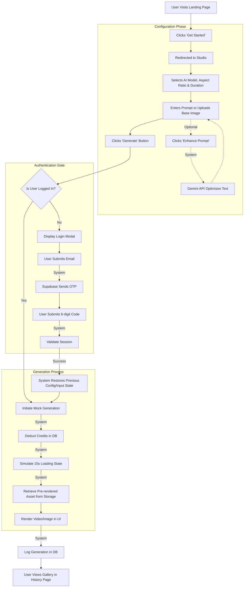
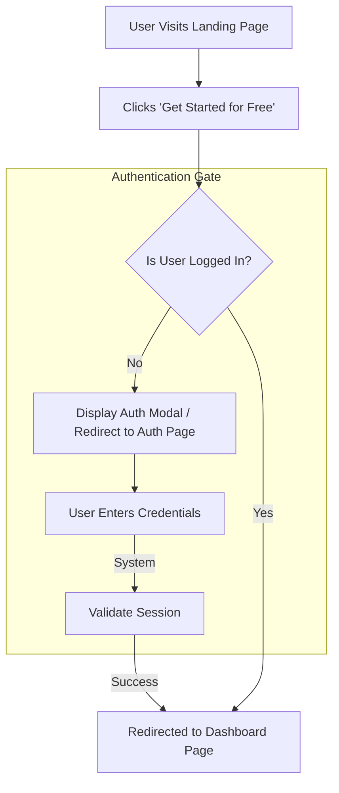

# Session Log - 2026-09-06

Session: `68c25efe` | Project: `AZAISCLONE` | Author: `antigravity-user`

---

[LOG_ENTRY type=PROMPT num=1 session=68c25efe]
timestamp: 2026-09-06T12:05:58Z
model: gemini-pro-agent

<USER_REQUEST>
so now we are going to redefine the flow.md file what does it curently lok like 
</USER_REQUEST>
<ADDITIONAL_METADATA>
The current local time is: 2026-09-06T13:05:58+01:00.

The user's current state is as follows:
Active Document: c:\Users\THE LAPTOP STORE\Desktop\AZAISCLONE\context\specs\00-build-plan.md (LANGUAGE_MARKDOWN)
Cursor is on line: 20
Other open documents:
- c:\Users\THE LAPTOP STORE\Desktop\AZAISCLONE\context\specs\00-build-plan.md (LANGUAGE_MARKDOWN)
Running terminal commands:
- npm run dev (in c:\Users\THE LAPTOP STORE\Desktop\AZAISCLONE, running for 27m0s)
</ADDITIONAL_METADATA>
<USER_SETTINGS_CHANGE>
The user changed setting `Model Selection` from None to Gemini 3.1 Pro (High). No need to comment on this change if the user doesn't ask about it. If reporting what model you are, please use a human readable name instead of the exact string.
</USER_SETTINGS_CHANGE>


[LOG_ENTRY type=RESPONSE num=1 session=68c25efe]
timestamp: 2026-09-06T12:07:29.524Z
model: gemini-pro-agent

Here is the current content of the `flow.md` file:

```markdown
# User Journey & Application Flow

This document outlines the core user journey for the AzaisAI Clone, mapped out step-by-step using Mermaid.js. It focuses strictly on user actions, system decisions, and state changes.

## Core Generation Flow

The following flowchart details the exact path a user takes from landing on the site to configuring their generation, passing the authentication gate, and receiving their media.



## Key Architectural Decisions in this Flow:
1. **Unauthenticated Access:** The user is allowed deep into the product (configuring models and prompts) before being prompted to log in. This maximizes conversion.
2. **State Persistence:** The bridge between `Verify` and `RestoreState` relies heavily on Zustand `localStorage` to ensure the user's selected model and typed prompt are not lost.
3. **Mock Async Pipeline:** The 15-second polling state accurately simulates how real AI Video APIs (like Runway or Sora) operate, demonstrating frontend polling mechanics without the backend complexity.
```

How would you like to redefine this flow?


[LOG_ENTRY type=PROMPT num=2 session=68c25efe]
timestamp: 2026-09-06T12:26:06Z
model: gemini-pro-agent

<USER_REQUEST>
the landing page, you click get strted for freee, the suth omdla shows or you are directed tot the auth page you need that, and from there you are converted or moved to the dahbaord page, that is it,,  do you understand
</USER_REQUEST>
<ADDITIONAL_METADATA>
The current local time is: 2026-09-06T13:26:06+01:00.

The user's current state is as follows:
Active Document: c:\Users\THE LAPTOP STORE\Desktop\six-file-context\README.md (LANGUAGE_MARKDOWN)
Cursor is on line: 962
Other open documents:
- c:\Users\THE LAPTOP STORE\Desktop\six-file-context\README.md (LANGUAGE_MARKDOWN)
- c:\Users\THE LAPTOP STORE\Desktop\six-file-context\templates\context\ai-workflow-rules.md (LANGUAGE_MARKDOWN)
- c:\Users\THE LAPTOP STORE\Desktop\six-file-context\templates\context\design.md (LANGUAGE_MARKDOWN)
Running terminal commands:
- npm run dev (in c:\Users\THE LAPTOP STORE\Desktop\AZAISCLONE, running for 47m8s)
</ADDITIONAL_METADATA>


[LOG_ENTRY type=RESPONSE num=2 session=68c25efe]
timestamp: 2026-09-06T12:27:36.163Z
model: gemini-pro-agent

Yes, I understand perfectly. I've completely updated the [`flow.md`](file:///C:/Users/THE%20LAPTOP%20STORE/Desktop/AZAISCLONE/flow.md) file to reflect this simplified journey. 

Here is the new content of the file:

```markdown
# User Journey & Application Flow

This document outlines the core user journey for the application, mapped out step-by-step using Mermaid.js. It focuses strictly on user actions, system decisions, and state changes.

## Core Generation Flow

The following flowchart details the exact path a user takes from landing on the site to accessing their dashboard.



## Key Architectural Decisions in this Flow:
1. **Authenticated Access Only:** Users must authenticate before accessing the core application (Dashboard). This simplifies state management and ensures all actions are tied to a registered user from the start.
2. **Simplified Onboarding:** The journey from landing page to the core application is direct, minimizing friction and complex unauthenticated state handling.
```

This ensures that the authentication gate happens immediately after they decide to get started, acting as a gateway to the Dashboard. What's the next step you'd like to tackle in the build plan?


