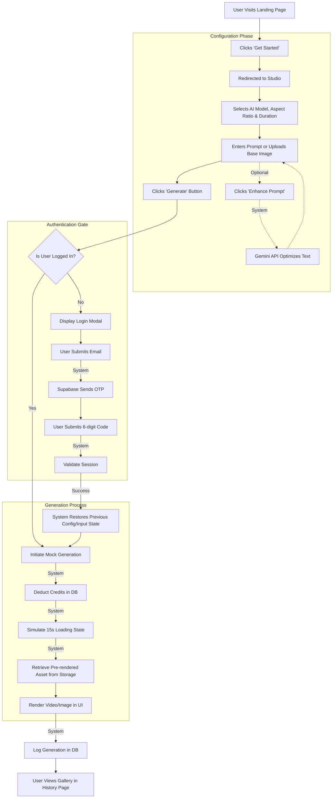

# User Journey & Application Flow

This document outlines the core user journey for the AzaisAI Clone, mapped out step-by-step using Mermaid.js. It focuses strictly on user actions, system decisions, and state changes.

## Core Generation Flow

The following flowchart details the exact path a user takes from landing on the site to configuring their generation, passing the authentication gate, and receiving their media.

## Key Architectural Decisions in this Flow:
1. **Unauthenticated Access:** The user is allowed deep into the product (configuring models and prompts) before being prompted to log in. This maximizes conversion.
2. **State Persistence:** The bridge between `Verify` and `RestoreState` relies heavily on Zustand `localStorage` to ensure the user's selected model and typed prompt are not lost.
3. **Mock Async Pipeline:** The 15-second polling state accurately simulates how real AI Video APIs (like Runway or Sora) operate, demonstrating frontend polling mechanics without the backend complexity.
