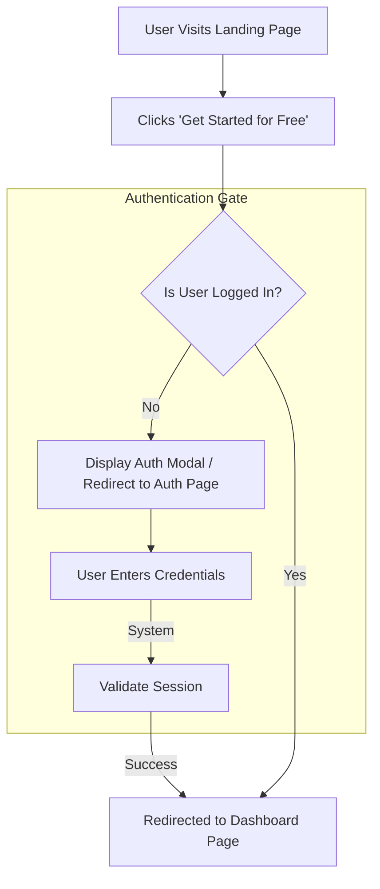

# User Journey & Application Flow

This document outlines the core user journey for the application, mapped out step-by-step using Mermaid.js. It focuses strictly on user actions, system decisions, and state changes.

## Core Generation Flow

The following flowchart details the exact path a user takes from landing on the site to accessing their dashboard.

## Key Architectural Decisions in this Flow:
1. **Authenticated Access Only:** Users must authenticate before accessing the core application (Dashboard). This simplifies state management and ensures all actions are tied to a registered user from the start.
2. **Simplified Onboarding:** The journey from landing page to the core application is direct, minimizing friction and complex unauthenticated state handling.
